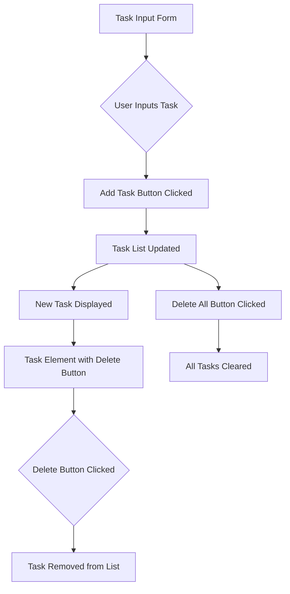

Chosen Feature: Assignment/Add Tasks

Diagram:

Description: The user enters a task in the input form. When the "Add Task" button is clicked, the new task is added to the list. The newly added task appears in the task list, each with a delete button. If the user clicks the delete button next to a task, that task is removed from the list.
Alternatively, if the user clicks the "Delete All" button, all tasks are cleared from the list at once.
This flow allows users to add tasks, view them in a list, and remove tasks individually or all at once.

