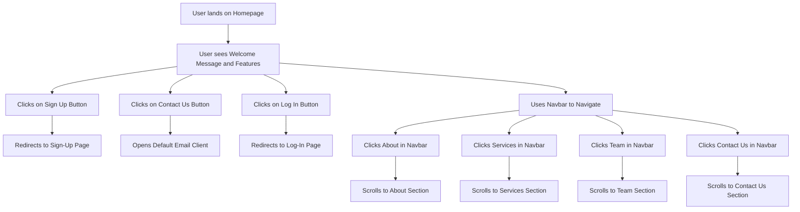

HomePage diagram: 

Details: 

This shows how users interact with the homepage and navigate its features. When users land on the homepage, they see a welcome message and an overview of the site's features. From there, they can click the sign up button to be redirected to the sign-up page or the log in button to access the login page. If users need to get in touch, clicking the contact us button opens their default email client with pre-filled recipient details. The navigation bar allows users to easily explore different sections of the page. Clicking about scrolls to the about section, services leads to the services section, team highlights the team section, and contact us scrolls to the contact us section. This flow ensures a smooth and user-friendly experience across the homepage.
