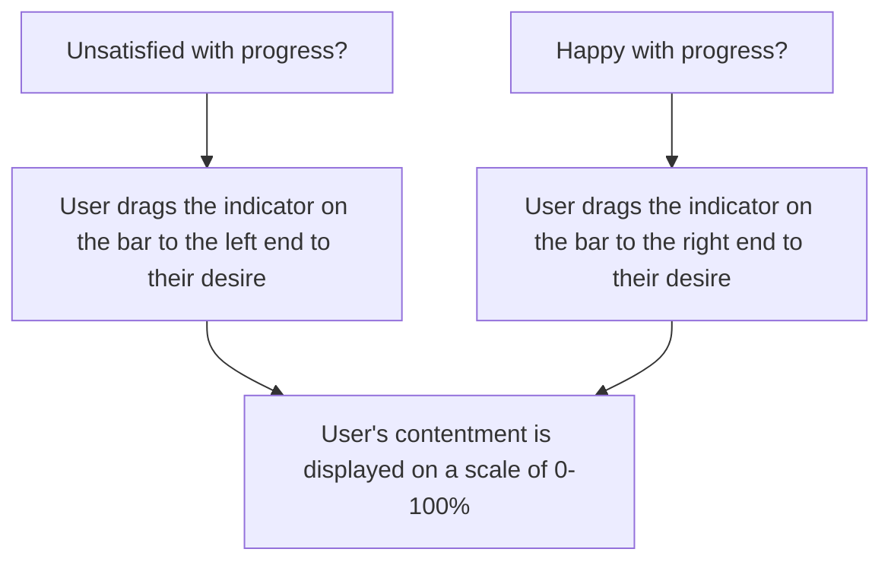

Chosen Feature: Contentment Progress Bar

Note: This feature was done in collaboration with Paola Aoun.

Diagram:

Description:
This flowchart outlines a user's ability to mark their contentment with a progress bar. Specifically, if a user is satisfied with their current progress on their tasks, they can drag the indicator to the right, depending on how happy they are. Otherwise, they can drag the indicator to the left if they are not satisfied. A user does not have to update this feature at certain points—it is simply there to help them track how content they are with what they have done.
