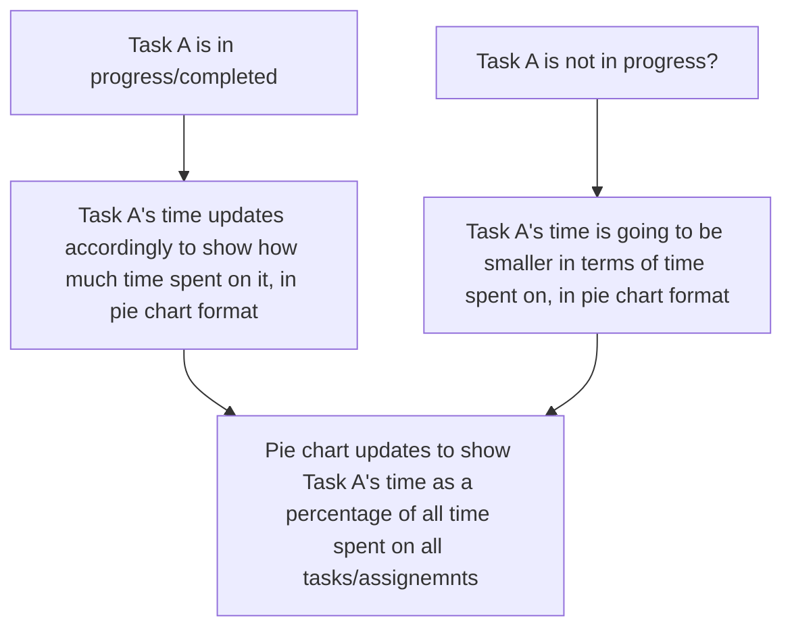

Chosen Feature: Assignment/Task Time Tracker

Diagram:

```mermaid
flowchart TD;
    A[Task A is in progress/completed] --> B[Task A's time updates accordingly to show how much time spent on it, in pie chart format];
    C[Task A is not in progress?] --> D[Task A's time is going to be smaller in terms of time spent on, in pie chart format];
    B --> E[Pie chart updates to show Task A's time as a percentage of all time spent on all tasks/assignemnts]
    D --> E[Pie chart updates to show Task A's time as a percentage of all time spent on all tasks/assignemnts]
```

Description:
