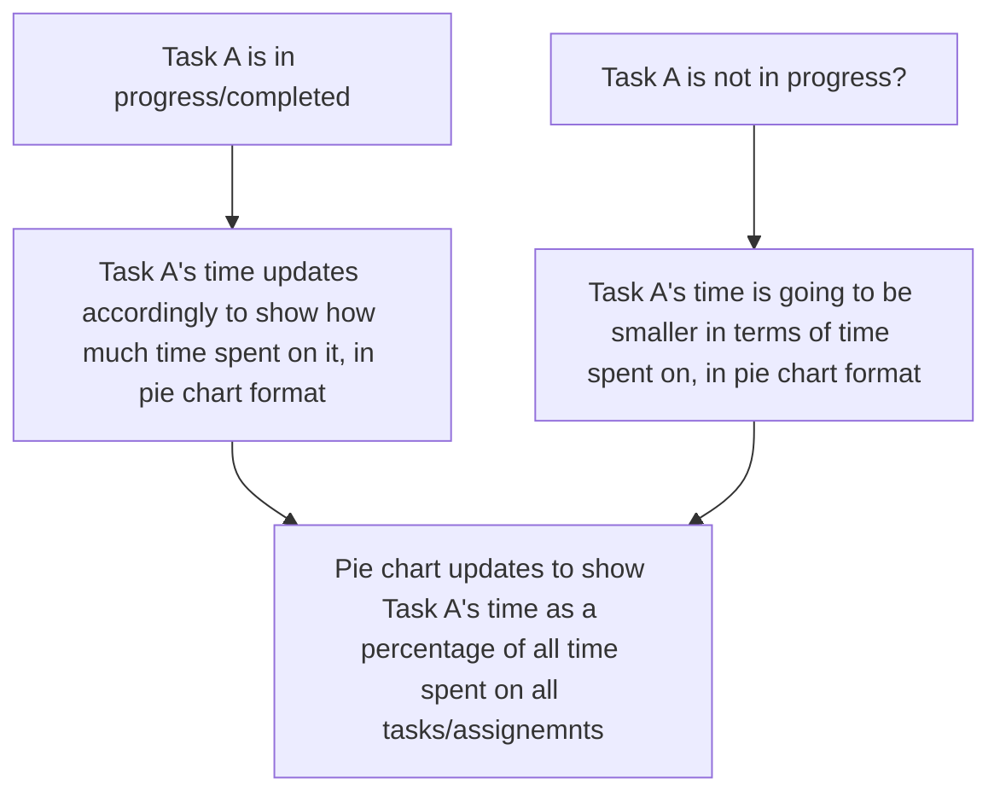

Chosen Feature: Assignment/Task Time Tracker

Diagram:

Description:
This flow chart shows the resulting effects of what happens when a user is/is not in progress (or done) with a certain task/assignment, and the corresponding time spent on that task/assignment. Specifically, when a user spends more time on a current task/assignment, the pie chart will update to show that that task's "slice" in the pie chart will be bigger (and the other "slices" will be smaller), and vice-versa (i.e. less time, smaller "slice").
